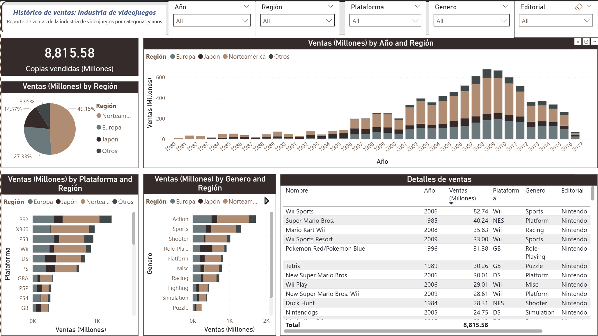

# 🎮 Global Video Game Sales Analysis

This repository contains an interactive dashboard designed to analyze video game sales trends throughout history. The report identifies which regions, platforms, and genres have had the greatest commercial impact.

*(Interactive report preview)*

---

## 🛠 Tools Used
* **Microsoft Power BI Desktop**
* **Power Query:** ETL processes (Data cleaning).
* **DAX:** Basic measures for sales calculations.

## 📊 Project Features
* **Data Connection:** Imported from Excel/CSV.
* **Data Modeling:** Star Schema implementation.
* **Visualization:** Bar charts, pie charts, and KPIs.
* **Interactivity:** Filtering by Region (NA, EU, JP), Platform, and Genre.

## 📄 Credits
Project built as part of the **"Power BI en Español"** course by Javier Gómez on Udemy.
